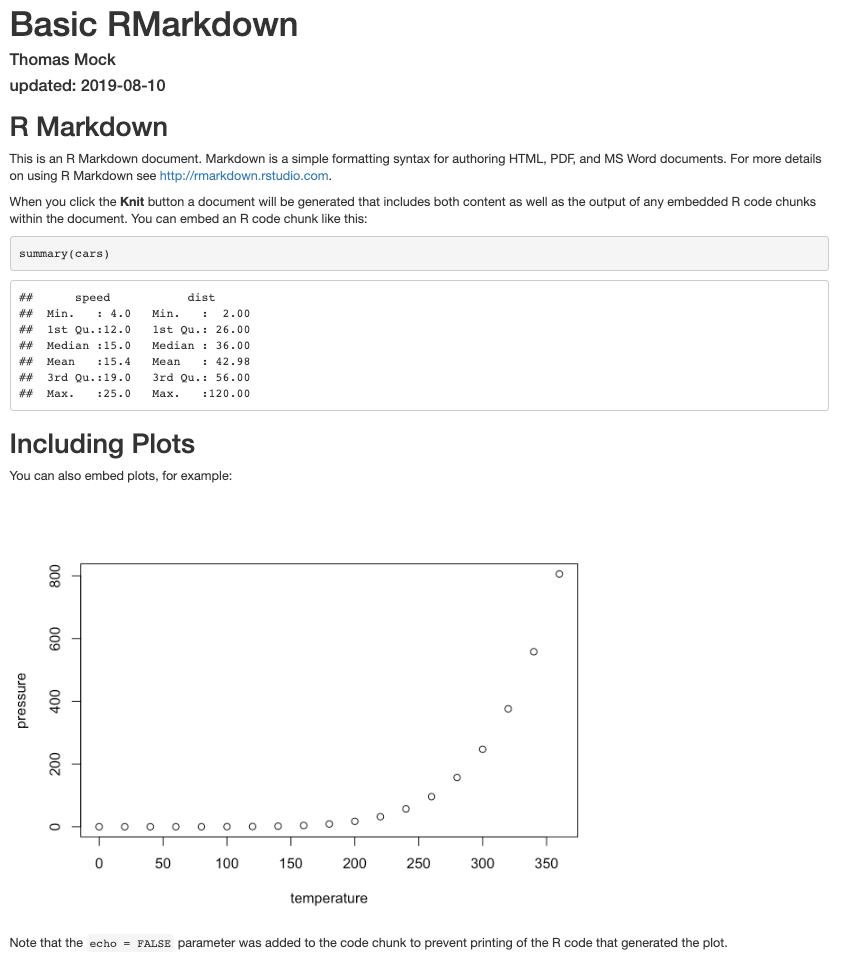
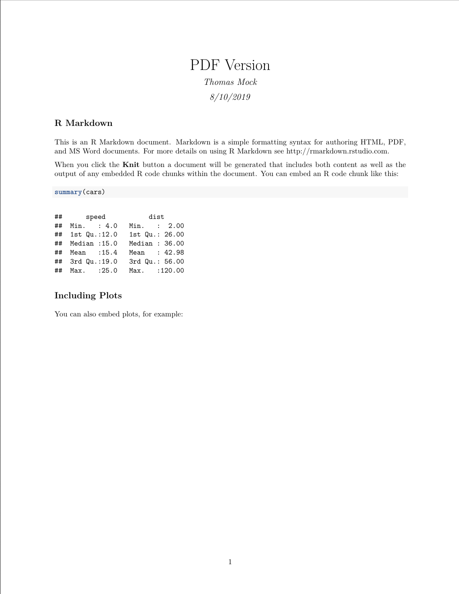
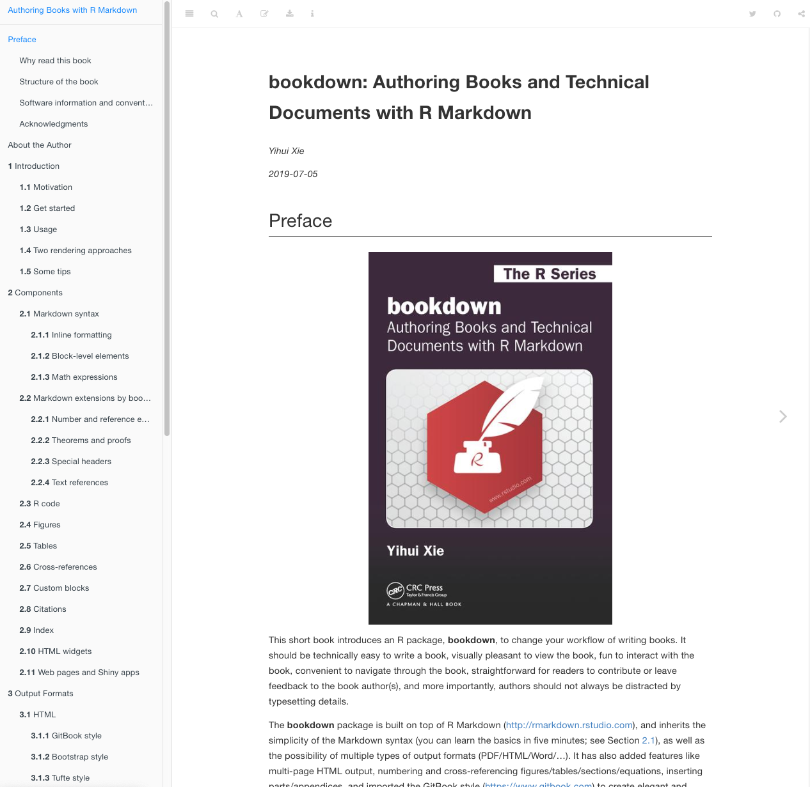
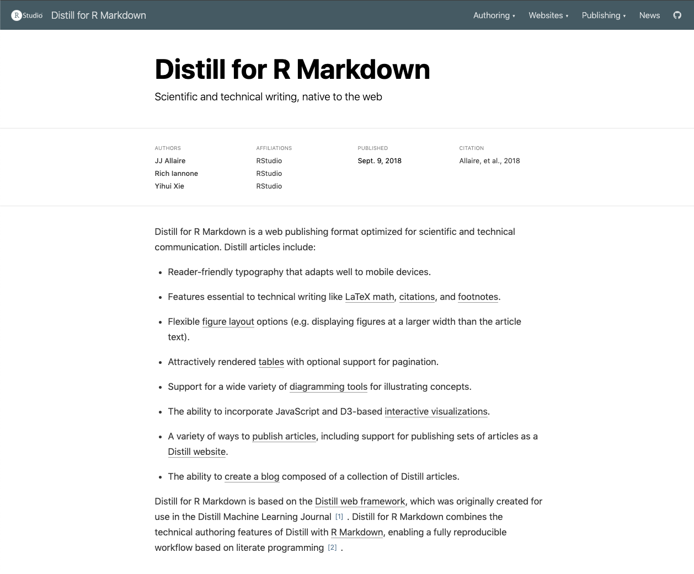
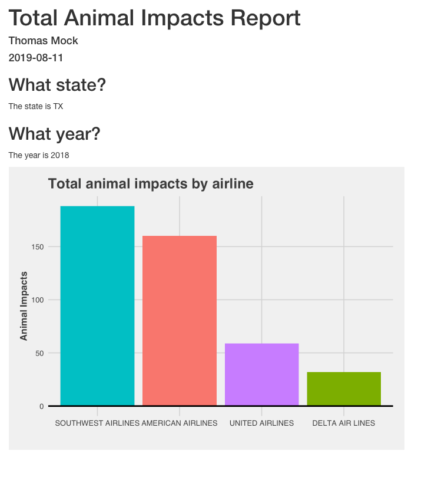
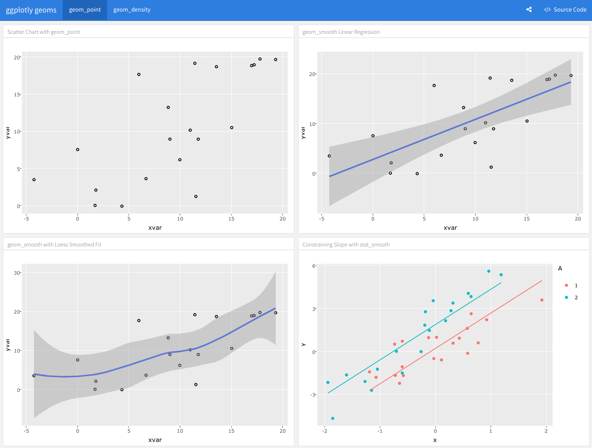
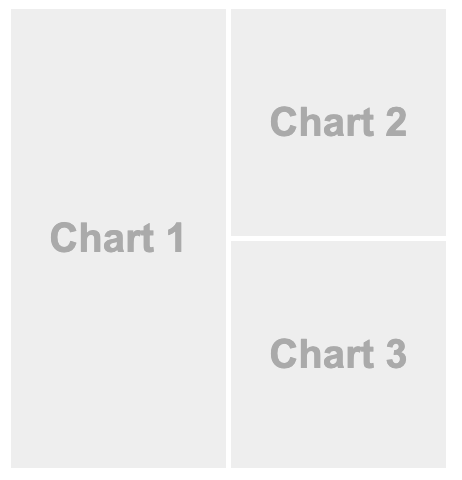
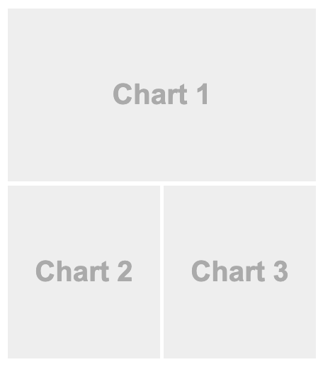

```{r setup, include=FALSE}
options(htmltools.dir.version = FALSE)
library(knitr)
knitr::opts_chunk$set(warning = FALSE, message = FALSE)
# options(knitr.table.format = "html")
library(tidyverse)
library(gt)
library(DT)
# https://images.unsplash.com/photo-1513890333407-6f85205e8ef2?ixlib=rb-1.2.1&ixid=eyJhcHBfaWQiOjEyMDd9&auto=format&fit=crop&w=1350&q=80
```


name: xaringan-title
class: left, middle
background-image: url(static-img/wool.jpg)
background-size: cover

# Intro to `RMarkdown`

### The Magic of "**knitting**"

.large[Thomas Mock | `r Sys.Date()`]


<!-- this ends up being the title slide since seal = FALSE-->

---

# Today's Agenda in `rmarkdown`

### Basics of `rmarkdown`

--

### Output Formats

--

- Presentations
  - `Xaringan`
  - Powerpoint

--

- Websites
  - `Bookdown`
  - `Distill`

--

- Reports
  - Parameterization
  - `Flexdashboard`


---

class: right, middle
`r knitr::include_graphics("https://raw.githubusercontent.com/allisonhorst/stats-illustrations/master/rstats-artwork/rmarkdown_wizards.png")`

---

### `rmarkdown`

- Starts as a notebook style interface
  - Mixes `code` with **prose**
  
--

- **Knits** to [dozens of different formats](https://rmarkdown.rstudio.com/formats.html)
  - HTML
  - PDF
  - Handouts
  - Books
  - Reports
  - Dashboards
  - Interactive `shiny` apps
  - Articles
  - Websites

---

.pull-left[
### `rmarkdown`

- Starts as a notebook style interface
  - Mixes `code` with **prose**

- **Knits** to [dozens of different formats](https://rmarkdown.rstudio.com/formats.html)
  - HTML
  - PDF
  - Handouts
  - Books
  - Reports
  - dashboards
  - Interactive `shiny` apps
  - Articles
  - Websites
]


.pull-right[

### Example


]

---

.pull-left[
Basic `html_document`



]

.pull-right[
Basic `pdf_document`

]

---

# Components of `rmarkdown`

`YAML` Header

```{r, eval = FALSE}
---
title: "My Title"
author: "Thomas Mock"
date: "2019-08-13"
output: html_document
---
```

---

class: center, middle
background-image: url(https://images.unsplash.com/photo-1510843572979-e4b9e790fdd7?ixlib=rb-1.2.1&ixid=eyJhcHBfaWQiOjEyMDd9&auto=format&fit=crop&w=1393&q=80)

.huge[Live Demo]


---

## Resources

### [R Markdown Guide](https://rmarkdown.rstudio.com/lesson-1.html)
### [R Markdown Book](https://bookdown.org/yihui/rmarkdown/)
### [R Markdown Cheatsheet](https://www.rstudio.com/resources/cheatsheets/#rmarkdown)

---

class: left, top
background-image: url(https://images.unsplash.com/photo-1535016120720-40c646be5580?ixlib=rb-1.2.1&ixid=eyJhcHBfaWQiOjEyMDd9&auto=format&fit=crop&w=1350&q=80)

.huge[Presentations]

---

# Knit to Powerpoint

The basics start with output.

```{r, eval = FALSE}
---
title: "My Presentation"
output:
  powerpoint_presentation
---
```

--

But you can also use a reference presentation for formatting

```{r, eval = FALSE}
---
title: "My Presentation"
output:
  powerpoint_presentation:
    reference_doc: my-styles.pptx
---
```

--

### [Example from `rmarkdown` book](https://bookdown.org/yihui/rmarkdown/powerpoint-presentation.html#ppt-templates)

### [Example from RStudio Solutions](https://solutions.rstudio.com/tour/access_to_care/)

---

# Powerpoint Example

.pull-left[
```{r, eval = FALSE}
---
title: "Habits"
author: John Doe
date: March 22, 2005
output: powerpoint_presentation
---

# In the morning

## Getting up

- Turn off alarm
- Get out of bed

## Breakfast

- Eat eggs
- Drink coffee

# In the evening

## Dinner

- Eat spaghetti
- Drink wine

---
```
]

--

.pull-right[

]

---

### But there is more to life than Powerpoint!

--

In fact, this is a presentation.

--

And THIS presentation was written in `R` code through an `rmarkdown` document.

--

The code for this presentation is *relatively* simple thanks to the `xaringan` package!


---
class: inverse

# Code to generate previous slide


```{r, echo = TRUE, eval = FALSE}
---

### But there is more to life than Powerpoint!

--

In fact, this is a presentation.

--

And THIS presentation was written in `R` code through an `rmarkdown` document.

--

The code for this presentation is *relatively* simple thanks to the `xaringan` package!


---
```

---


.pull-left[
## `xaringan`
- Technically, these slides are `HTML5`
- But we write almost pure `RMarkdown`
- `xaringan` does our conversion!
- This concept is the power of `RMarkdown`
  - Write R code -> knit to ???
  

]

--

.pull-right[
## Why write slides with code?
- Quickly reproduce
- Borrow and edit with code
- Generate tables, plots, and words without copy pasting!
- Stay close to the source (code)
]

### [`xaringan` guide](https://bookdown.org/yihui/rmarkdown/xaringan.html)

---

# Back to `mtcars`

Because `rmarkdown` can execute `R` code, you can generate reports/outputs inside of a presentation

--

The `mtcars` dataset has `r ncol(mtcars)` columns and `r nrow(mtcars)` rows.

--

We can also create a table for example via `knitr::kable()`.

--

`r knitr::kable(head(mtcars), 'html')`

---
class: inverse
### Previous Slide

```{r, eval = F, echo = TRUE}
---

# Back to `mtcars`

Because `rmarkdown` can execute `R` code, you can generate reports/outputs inside of a presentation

--

The `mtcars` dataset has `r ncol(mtcars)` columns and `r nrow(mtcars)` rows.

--

We can also create a table for example via `knitr::kable()`.

--

`r knitr::kable(head(mtcars), 'html')`

---
```

---

.left-column[
### `DT` package

```{r, echo = TRUE, eval = FALSE}
library(DT)
mtcars %>% 
  datatable()
```

### [`DT` Guide](https://rstudio.github.io/DT/)
]

--

.right-column[
```{r eval=require('DT'), tidy=FALSE, echo = F}
library(DT)
mtcars %>% 
  select(mpg:qsec) %>% 
  datatable()
```
]

---

.left-column[
### `gt` package

```{r, echo = TRUE, eval = FALSE}
library(gt)
head(mtcars) %>% 
  gt()
```

### [`gt` Guide](https://gt.rstudio.com/)
]

--

.right-column[
```{r, echo = FALSE}
library(gt)
head(mtcars) %>% 
  gt()
```
]

---

# `gt` does fancier tables too

```{r,echo = F, message = FALSE, warning=FALSE}
library(gt)
suppressWarnings(library(glue))

# Define the start and end dates for the data range
start_date <- "2010-06-07"
end_date <- "2010-06-14"

# Create a gt table based on preprocessed
# `sp500` table data
sp500 %>%
  dplyr::filter(date >= start_date & date <= end_date) %>%
  dplyr::select(-adj_close)
```

---
# `gt` does fancier tables too


```{r,echo = TRUE, eval = FALSE, message = FALSE, warning=FALSE}
# Define the start and end dates for the data range
start_date <- "2010-06-07"
end_date <- "2010-06-14"

# Create a gt table based on preprocessed
# `sp500` table data
sp500 %>%
  dplyr::filter(date >= start_date & date <= end_date) %>%
  dplyr::select(-adj_close) %>%
  gt() %>%
  tab_header(
    title = "S&P 500",
    subtitle = glue::glue("{start_date} to {end_date}")
  ) %>%
  fmt_date(
    columns = vars(date),
    date_style = 3
  ) %>%
  fmt_currency(
    columns = vars(open, high, low, close),
    currency = "USD"
  ) %>%
  fmt_number(
    columns = vars(volume),
    suffixing = TRUE
  )
```


---

# `gt` does fancier tables too

```{r,echo = F, message = FALSE, warning=FALSE}
library(gt)
suppressWarnings(library(glue))

# Define the start and end dates for the data range
start_date <- "2010-06-07"
end_date <- "2010-06-14"

# Create a gt table based on preprocessed
# `sp500` table data
sp500 %>%
  dplyr::filter(date >= start_date & date <= end_date) %>%
  dplyr::select(-adj_close) %>%
  gt() %>%
  tab_header(
    title = "S&P 500",
    subtitle = glue::glue("{start_date} to {end_date}")
  ) %>%
  fmt_date(
    columns = vars(date),
    date_style = 3
  ) %>%
  fmt_currency(
    columns = vars(open, high, low, close),
    currency = "USD"
  ) %>%
  fmt_number(
    columns = vars(volume),
    suffixing = TRUE
  )
```

---

.pull-left[

```{r, echo = FALSE}
r_2 <- round(summary(lm(mpg~disp, mtcars))$r.squared, 2)
```

### Fuel report

Fuel efficiency is declining with increased displacement
- The larger engine displacement accounts for `r r_2 * 100`% of the decline in fuel efficiency

```{r eval=require('DT'), tidy=FALSE, echo = FALSE}
library(DT)
mtcars %>% 
  rownames_to_column(var = "car") %>% 
  group_by(cyl) %>% 
  top_n(6) %>% 
  ungroup() %>% 
  select(car, disp, mpg) %>%
  datatable(
    options = list(
  pageLength = 6
    )
  )
```

]

--

.pull-right[


### DISP vs MPG (R<sup>2</sup>: `r r_2`)
```{r, echo = FALSE, fig.retina=3}
mtcars %>% 
  ggplot(aes(x = disp, y = mpg)) +
  geom_smooth(method = "lm", se = F, color = "red") +
  geom_point(size = 3) +
  ggthemes::theme_fivethirtyeight() +
  labs(x = "\nDisplacement",
       y = "Miles/Gallon\n") +
  theme(axis.title = element_text(face = "bold", size = 20))
```
]

---
class: inverse
### Previous Slide
.pull-left[

```{r, echo = T, eval = F}
r_2 <- lm(mpg~disp, mtcars) %>% 
  summary() %>% 
  .$r.squared %>% 
  round(2)

Fuel efficiency is declining with increased displacement
- The larger engine displacement accounts for `r r_2 * 100`% of the decline in fuel efficiency

library(DT)
mtcars %>% 
  rownames_to_column(var = "car") %>% 
  group_by(cyl) %>% 
  top_n(6) %>% 
  ungroup() %>% 
  select(car, disp, mpg) %>%
  datatable(
    options = list(
  pageLength = 6
    )
  )
```

]

.pull-right[

```{r, eval = F, echo = T}
### DISP vs MPG (R<sup>2</sup>: `r r_2`)

mtcars %>% 
  ggplot(aes(x = disp, y = mpg)) +
  geom_smooth(method = "lm", se = F, color = "red") +
  geom_point(size = 3) +
  ggthemes::theme_fivethirtyeight() +
  labs(x = "\nDisplacement",
       y = "Miles/Gallon\n") +
  theme(axis.title = element_text(face = "bold", size = 20))

```

]

---

class: left, middle
background-image: url(https://images.unsplash.com/photo-1468779036391-52341f60b55d?ixlib=rb-1.2.1&ixid=eyJhcHBfaWQiOjEyMDd9&auto=format&fit=crop&w=1521&q=80)
background-size: cover

https://bookdown.org/yihui/bookdown/images/logo.png

# `bookdown`


---


.left-column[
### `bookdown`
Best resource is at the published `bookdown` [*bookdown*](https://bookdown.org/yihui/bookdown/). `r emo::ji("wink")`
<br>
<br>


]

.right-column[

]

---

### Use cases for writing books in `rmarkdown`

- Writing books for external consumption
  - Examples of many published books at the [`bookdown` website](https://bookdown.org/)

--

- Writing books for internal consumption
  - Example of the `tidyverse` [style guide](https://style.tidyverse.org/)

--

- Alternative example of the [BBC R Graphics cookbook](https://bbc.github.io/rcookbook/)
  - Created with `cosmo` theme of `rmarkdown` (not `bookdown`)
  - Just has a table of contents (floating on left)
  - See their [GitHub](https://github.com/bbc/rcookbook/blob/master/index.Rmd) for all code to create

---

.left-column[
## `distill`

[Website](https://rstudio.github.io/distill/)

### Use Cases
- Website
- Blogs
- Technical docs

### Examples
- [RStudio Environments](https://environments.rstudio.com/)
- My [personal blog](https://themockup.netlify.com/)
]

.right-column[

]


---

class: center, top
background-image: url(https://images.unsplash.com/photo-1485402073834-c95f3eac2fcd?ixlib=rb-1.2.1&ixid=eyJhcHBfaWQiOjEyMDd9&auto=format&fit=crop&w=1354&q=80)

.huge[Reports]

---

# Reports

### Pain Point
- Writing reports is:
  - Manual 
  - Tedious 
  - Slow `r emo::ji("turtle")`
  
--

### Solution
Paramaters in `rmarkdown`! 
- Generate the *same* report BUT with *new data*
- All the code is identical
- The end result is according to the input data

---

### Situation: FAA data analyst
- My boss asks for a report on how many animals were hit by planes in TX last year

--

  - Goal: Create a report for TX in 2018

--

  - Result: I get the data, create a graph, paste into doc and send along `r emo::ji("sunglasses")`

--

- My boss emails me later that day
  - I need the report for 2015, 2016, and 2017 ASAP `r emo::ji("angry")`

--

  - Goal: Create 3 new reports

--

  - Result: I go back and get the data again, create 3x graphs, paste into 3 new docs, and send along `r emo::ji("tired")`
  
--

### Alternative

- Write a paramaterized `rmarkdown` report
  - Write the code 1x
  - Execute `n` times! `r emo::ji("nerd")`
  
---

class: center, top, inverse
background-image: url(static-img/knit-report.jpg)

.huge[Knit a Report]

---


.pull-left[
### Render reports programatically

```{r, eval = FALSE}
rmarkdown::render("param-report-programmatic.rmd",
                  params = list(
                    states = "TX",
                    years = "2018"
                  ))
```
]

--

.pull-right[

]

---


.pull-left[
### custom render function
```{r, eval = FALSE, echo = TRUE}
render_impact_report <- function(states, years){
  rmarkdown::render(
    "param-report-programmatic.rmd", 
    params = list(
      states = states,
      years = years
    ),
    output_file = 
      glue::glue("animal-impact-{states}-{years}.html")
  )
}

```

## one-off report

```{r, eval = FALSE, echo = TRUE}
render_impact_report(states = "TX", years = 2015)
```
]

--

.pull-right[
### Need to tell `render` function
- which file to use (`param-report-programmatic.rmd`)
- what parameters (`params`)
- output_file
  - Using `glue()` function to generate meaningful file names
  - `glue()` pastes in variables surrounded by `{}`
  
```{r}
states <- "TX"
years <- 2018

glue::glue("animal-impact-{states}-{years}.html")
```
  
]

---

### What about many reports?
--
 Say Hi to `purrr`

--

New `glue()` function
```{r, eval = FALSE}
output_state_yr <- function(states, years){
  glue::glue("The state is {states} and year is {years}")
}

output_state_yr("TX", 2019)
```

--

```{r, echo = FALSE}
output_state_yr <- function(states, years){
  glue::glue("The state is {states} and year is {years}")
}

output_state_yr("TX", 2019)
```

--

Apply `output_state_yr` across each of the states/years combos
```{r, eval = FALSE}
states <- rep("TX", 3)
years <- 2016:2018

purrr::pmap(.l = list(states, years), .f = output_state_yr)
```

--

```{r, echo = FALSE}
states <- rep("TX", 3)
years <- 2016:2018

purrr::pmap(.l = list(states, years), .f = output_state_yr)
```

---

### Back to our custom render function

```{r, eval = FALSE, echo = TRUE}
render_impact_report <- function(states, years){
  rmarkdown::render(
    "param-report-programmatic.rmd", 
    params = list(
      states = states,
      years = years
    ),
    output_file = 
      glue::glue("animal-impact-{states}-{years}.html")
  )
}

```


--

- We'll iterate across each combination of state + year
- Each combo will generate a report with a custom file name based on the input!
- This process scales from **1 report** to **100s of reports**


---

### Many Reports
Need to specify what states and what years are of interest

```{r, eval = TRUE}
states <- rep("TX", 4)
years <- 2015:2018

states
years
```

--

### Apply the function to each element of the vector
We can use `purrr` to apply function across the years (for loop is also fine, I just find `purrr` more readable)

```{r, eval = FALSE, echo = TRUE}
purrr::pmap(.l = list(states, years), .f = render_impact_report)
```


---

### Altogether now

##### Write the function

```{r, eval = FALSE, echo = TRUE}
render_impact_report <- function(states, years){
  rmarkdown::render(
    "param-report-programmatic.rmd", 
    params = list(
      states = states,
      years = years
    ),
    output_file = 
      glue::glue("animal-impact-{states}-{years}.html")
  )
}

```

--

##### Then specify the paramater inputs

```{r, eval = FALSE}
states <- rep("TX", 4)
years <- 2015:2018
```

--

##### Then `knit`/`render` the 4x reports!

```{r, eval = FALSE, echo = TRUE}
purrr::pmap(.l = list(states, years), .f = render_impact_report)
```

---

class: left, middle
background-image: url(https://images.pexels.com/photos/590041/pexels-photo-590041.jpeg?auto=compress&cs=tinysrgb&dpr=2&h=650&w=940)

.huge[Dashboards]

---

### Enter `flexdashboard`

--

If you can create a `ggplot` you can create a `flexdashboard`!

--

```{r, echo = FALSE, out.width = "50%"}

```

--

##### [`flexdashboard` Site](https://rmarkdown.rstudio.com/flexdashboard/index.html)

---

.pull-left[
### Column-based
```{r, eval = FALSE}
---
title: "Column Orientation"
output: flexdashboard::flex_dashboard
---
    
Column
-------------------------------------
    
### Chart 1
    
   
Column
-------------------------------------
   
### Chart 2

 
### Chart 3
    

```

]

--

.pull-right[
### Column-output
```{r, echo = FALSE, out.width = "95%"}

```
]


---

.pull-left[
### Row-based
```{r, eval = FALSE}
---
title: "Row Orientation"
output: 
  flexdashboard::flex_dashboard:
    orientation: rows
---
    
Row
-------------------------------------
    
### Chart 1
    

   
Row
-------------------------------------
    
### Chart 2
    

    
### Chart 3

```

]

--

.pull-right[
### Row-output
```{r, echo = FALSE, out.width = "90%"}

```
]

---

class: center, middle
background-image: url(https://images.unsplash.com/photo-1510843572979-e4b9e790fdd7?ixlib=rb-1.2.1&ixid=eyJhcHBfaWQiOjEyMDd9&auto=format&fit=crop&w=1393&q=80)

.huge[Live Demo]

---

# Resources

The best single source is [`R Markdown`: The Definitive Guide](https://bookdown.org/yihui/rmarkdown/), available online or in text
- [`rmarkdown` website](https://rmarkdown.rstudio.com/)
- [Paramaterized Reports](https://bookdown.org/yihui/rmarkdown/parameterized-reports.html)
- [`xaringan` presentations](https://bookdown.org/yihui/rmarkdown/xaringan.html)
- [Powerpoint Presentations](https://bookdown.org/yihui/rmarkdown/powerpoint-presentation.html)
- [`flexdashboard`](https://rmarkdown.rstudio.com/flexdashboard/)
- [`bookdown`](https://bookdown.org/)
- [`distill`](https://rstudio.github.io/distill/)
- [HTML Documents](https://bookdown.org/yihui/rmarkdown/html-document.html)

### [Open RStudio Cloud](https://rstudio.cloud/spaces/21803/join?access_code=57Bia9nNqeqrEPNXOUDCapigwol3voqsyjeNXjUT)

---

class: left, middle
background-image: url(https://images.unsplash.com/photo-1522292923399-bf8ddbd6e4e2?ixlib=rb-1.2.1&ixid=eyJhcHBfaWQiOjEyMDd9&auto=format&fit=crop&w=1300&q=80)

