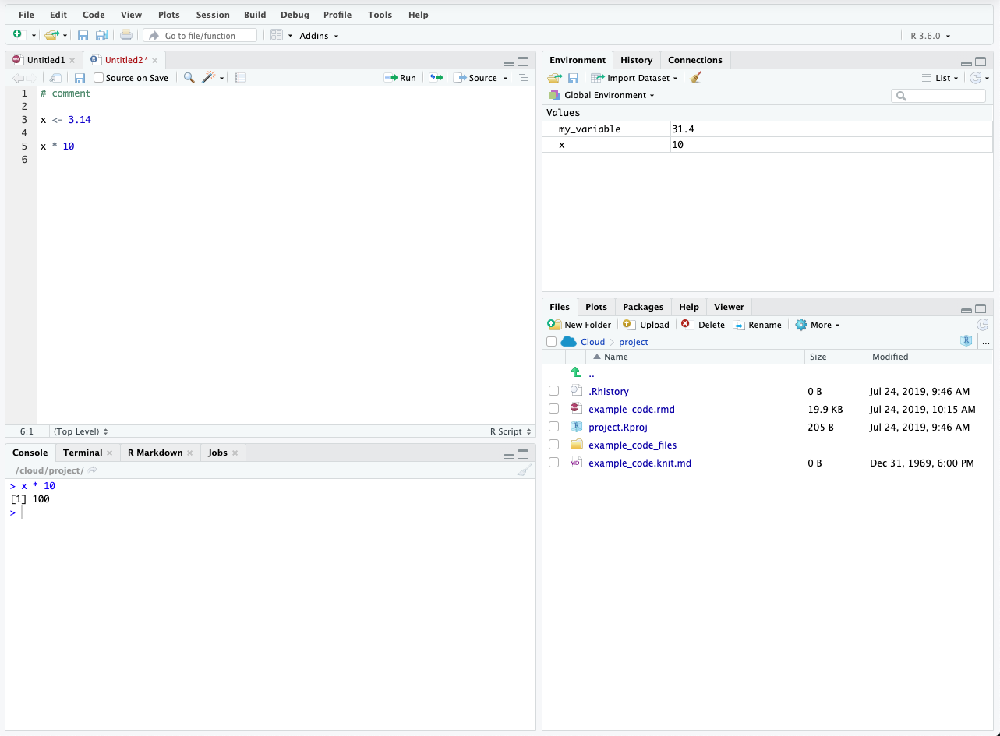
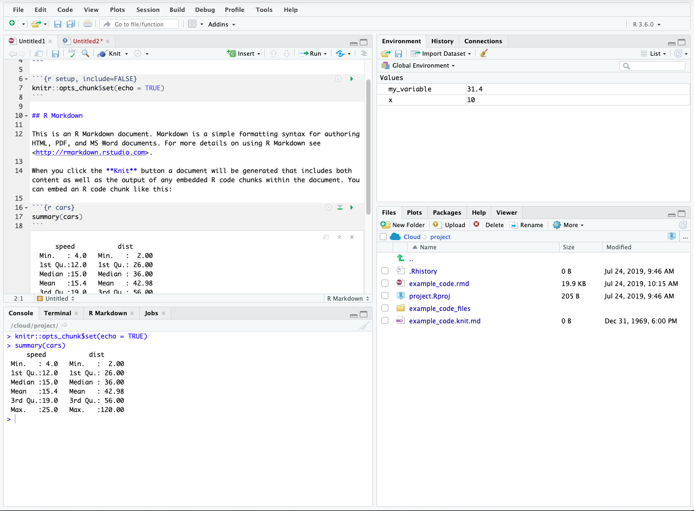
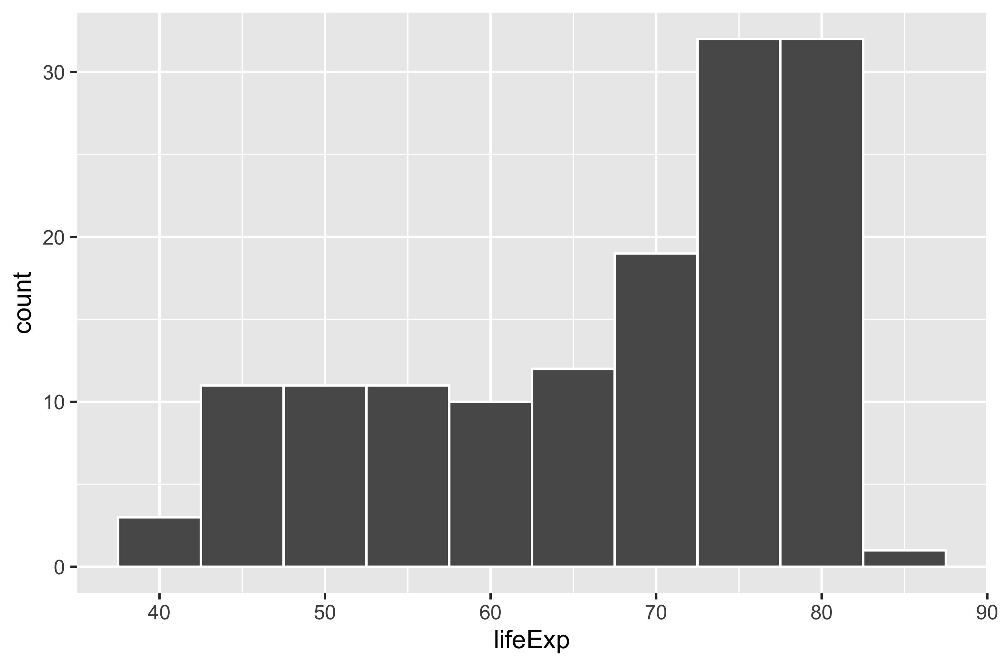

```{css, include = FALSE, eval = TRUE}
/* Extra CSS */
.hljs-github .hjls {
  background: black;
}
.small {
  font-size: 70%;
}

.tiny {
  font-size: 60%;
}

.large {
  font-size: 200%;
}

.small pre .remark-code {
  font-size: 75%;
}
.small .remark-code {
  font-size: 80%;
}
.tiny .remark-code {
  font-size: 60%;
}
.medium .remark-code {
  font-size: 90%;
}

```

# Today's Agenda

- RStudio
  - Writing code
  - File manipulation
  - Package control

--

- R coding basics
  - Math
  - Assignment
  - Functions
  - Load and install packages

--

- `Tidyverse`
  - Read data in with `readr`
  - Tidy data with`tidyr`
  - Transform data with `dplyr`
  - Plot data with `ggplot2`
  


---

# RStudio

RStudio is an IDE (integrated development environment)  

- A place to write  
  - Console
  - R Scripts
  - R Markdown
  - Code Completion
  - Debugging
  
--

- A place to open *things*  
  - File and path exploration
  - Open plots, data, .R/.Rmd file
  
--

- A place for projects  
  - Self-contained structure
  - Consistent/easy pathing
  - Keep relevant files/code together with output
  
  

---

class: center, middle, inverse

# `RStudio Basics`

---

  

---



---



---

# RStudio Diagnostics

The script editor highlights syntax errors

  

--

Hover over the cross to see the problem
  

--

RStudio also warns about potential problems
  
  
  

---


# Everyone makes mistakes!

Errors are *ok*, it happens to everyone!

```{r, eval = FALSE}
my_variable <- x * 3.14

my_variab1e
```

```{r, echo = FALSE}
x <- 10
my_variable <- x * 3.14
```

```{r, echo = FALSE}
warning("# Error: object 'my_variab1e' not found")
```

--

```{r}
my_variable
```


--

* R is essentially the most aggressive spell-checker of all time!

--

* Focus on what the error says and if you don't understand it, Googling can often help!

---

class: center, middle, inverse

# R Code Basics

---

# R Code Basics

Assignment

.pull-left[
```{r, eval = TRUE}
x <- 3 * 4
x
```


```{r}
y <- 5
y * x
```

]

--

.pull-right[
```{r}
tmp_df <- data.frame(
  col_1 = c(1, 2, 3), 
  col_2 = c("a", "b", "c")
  )

tmp_df
```


]
  
  


---

# Functions

A function is essentially shorthand to call specific code

```{r, echo = FALSE}
suppressWarnings(suppressPackageStartupMessages(library(tidyverse)))
```


```{r, eval = FALSE}
function_name(arg1, arg2, arg3)
```
  
--

```{r, eval = FALSE}
seq(from, to, by, 
    length.out, along.with)
```


--

```{r}
seq(from = 10, to = 100, by = 10)  
```

--

```{r}
seq(10, 100, 10)  
```

--

```{r}
result_out <- seq(10, 100, length.out = 5)  

result_out
```


---

# The `%>%` `==` and then

Rather than multiple assignment or nesting functions

```{r, eval = FALSE}

did_something <- do_something(data)

did_another_thing <- do_another_thing(did_something)

final_thing <- do_last_thing(did_another_thing)

```

--

```{r, eval = FALSE}
final_thing <- do_last_thing(
  do_another_thing(
    do_something(
      data
      )
    )
  )
```


--

```{r, eval = FALSE}
final_thing <- data %>% 
      do_something() %>% 
      do_another_thing() %>% 
      do_last_thing()
```


---

# The Pipe `%>%`

 
```{r, eval = FALSE}
data %>% 
  do_something(.) %>% 
  do_another_thing(.) %>% 
  do_last_thing(.)
```

--

`do_something(data)` is equivalent to:  

--

* `data %>% do_something(data = .)`  

--

* `data %>% do_something(.)`  

--

* `data %>% do_something()`  

---

```{r}
data_in <- seq(10, 100, by = 10)

result_out <- mean(data_in)

result_out
```


--

```{r}
mean(seq(10,100, by = 10))
```

--


```{r}
seq(10, 100, by = 10) %>%
  mean()
```

--

```{r}
mean_output <- seq(10, 100, by = 10) %>%
  mean()

mean_output
```


---

## About the penguins

```{r, echo = FALSE}
data <- tibble(
  year = rep(2018, 10),
  gender = rep(c("Male", "Female"), each = 5),
  age_group = rep(c("< 18", "18-30", "31-50", "51-60", "> 60"), each = 2),
  income = c(20000, 22000, 35000, 36000, 40000, 50000, 60000, 62000, 72000, 75000)
) %>% 
  mutate(age_group = factor(age_group, levels = c("< 18", "18-30", "31-50", "51-60", "> 60")
                            )
  )

data <- bind_rows(data, data) %>% 
  bind_rows(data) %>% 
  bind_rows(data)

```


```{r}
penguins <- palmerpenguins::penguins 

penguins %>% 
  glimpse()
```

---

# More Complex Example

```{r, eval = FALSE}
penguins %>% 
  filter(species == "Adelie" & !is.na(sex)) %>%                   
  group_by(sex, island) %>%                                 
  summarize(mean = mean(body_mass_g, na.rm = TRUE)) 
```

--

```{r, echo = FALSE}
penguins %>% 
  filter(species == "Adelie" & !is.na(sex)) %>%                   
  group_by(sex, island) %>%                                 
  summarize(mean = mean(body_mass_g, na.rm = TRUE)) 
```


---

class: center, middle

background-image: url("static-img/tidyverse-default.png")


---

# `Tidyverse`
An opinionated collection of R packages for data science.   
<br>
  
--

All packages share an underlying design philosophy, grammar, and data structures  

--

* Core packages - `readr`, `tidyr`, `dplyr`, `ggplot2`

--


---

# `Tidyverse`

`Tidyverse` is an R package, as such you need to do two things to be able to use it
* `install.packages("tidyverse")`
  * This downloads and installs the `tidyverse`

--
  
* `library(tidyverse)`
  * This loads and gives you access to the `tidyverse` package

---

# `tidyverse` Core Principles

* Built around `data` - usually as a `data.frame` or `tibble`
* Built around `tidy` data
  * Each `variable` in its own `column`
  * Each `observation` or `case` in its own `row`
  * Each type of observational units forms a table


```{r, echo = FALSE}

untidy_df <- tibble(
  age_group = c("< 18", "18-30", "31-50", "51-60", "> 60"),
  male_2016 = c(22000, 36000, 50000, 62000, 75000),
  female_2016 = c(20000, 35000, 40000, 60000, 72000), 
  male_2017 = c(22000, 36000, 50000, 62000, 75000),
  female_2017 = c(20000, 35000, 40000, 60000, 72000),
  male_2018 = c(22000, 36000, 50000, 62000, 75000),
  female_2018 = c(20000, 35000, 40000, 60000, 72000)
  )

tidy_df <- untidy_df %>% 
  gather(gender_year, income, male_2016:female_2018) %>% 
  separate(gender_year, into = c("gender", "year"))

```

```{r, eval = FALSE, echo = FALSE}
test_penguin <- penguins %>% 
  filter(sex %in% c("MALE", "FEMALE")) %>% 
  select(species, sex, body_mass_g) %>% 
  group_by(species, sex) %>% 
  summarize(body_mass_g = mean(body_mass_g)) %>% 
  pivot_wider(names_from = c("sex", "species"), values_from = c("body_mass_g"))
```


--


---

# Untidy data

```{r, highlight.output = 2}
untidy_df
```


---

# Tidy data

```{r, highlight.output = c(4, 9)}
tidy_df
```

---

# Tidy the data

```{r, highlight.output = c(4, 9)}
untidy_df %>% 
  pivot_longer(cols = male_2016:female_2018, 
               names_to = "gender_year",
               values_to = "income") %>% 
  separate(gender_year, into = c("gender", "year")) #<<
```


---
# Tidy the data

```{r, highlight.output = c(4, 9)}
untidy_df %>% 
  pivot_longer( 
    cols = male_2016:female_2018, #<<
    names_to = c("gender", "year"), #<<
    names_pattern = "(.*)_(.*)", #<<
    values_to = "income" #<<
  )
```

---

# Read data in

Read in data with `readr`, `haven`, `readxl`

### `readr`
* `read_csv()`, `read_tsv()`, `read_delim()`

### `haven`
* `read_sas()`, `read_spss()`, `read_stata()`, `read_dta()`

### `readxl`
* `read_xls()`, `read_xlsx()`, `read_excel()`

---


.pull-left[
### `dplyr`

### 6 Main verbs
* `filter()`
* `arrange()`
* `select()`
* `mutate()`
* `group_by()`
* `summarise()`

### Simple use
* `pull()`
* `n()`/`count()`
* `glimpse()`
]

--

.pull-right[
### Advanced iterations
* `across()`
* `rowwise()`

### More info
* [`dplyr.tidyverse.org`](https://dplyr.tidyverse.org/)
* [`R for Data Science`](https://r4ds.had.co.nz/transform.html)  

```{r, echo = FALSE, out.width= "40%"}
knitr::include_graphics("static-img/hex-dplyr.png")
```

]

---

#### Meet the penguins

.center[  ]


---

.center[  ]

---

# penguins dataset

`data.frame` vs `tibble`


```{r}
penguin_df <- palmerpenguins::penguins %>% as.data.frame()
class(penguin_df)
```

--


```{r}
penguins <- as_tibble(penguin_df)

class(penguins)
```


---

# penguins dataset

`data.frame` vs `tibble`

```{r, highlight.output = c(1:3)}
penguin_df
```


---

# penguins dataset

```{r}
penguins <- as_tibble(penguin_df)
```


```{r, highlight.output = c(1:3)}
penguins
```


---

# penguins dataset

```{r}
head(penguins, 5)
```

--

```{r}
tail(penguins, 5)
```

---

### [`dplyr::slice()`](https://dplyr.tidyverse.org/reference/slice.html)


```{r, highlight.output = c(4, 6)}
slice(penguins, 1:3)
```

--

```{r,highlight.output = c(4,5)}
slice(penguins, 1, 3, 5)
```

---

#### [`dplyr::slice_min()`](https://dplyr.tidyverse.org/reference/slice.html) & [`dplyr::slice_max()`](https://dplyr.tidyverse.org/reference/slice.html)


```{r,highlight.output = c(3:5)}
# bottom 3 beak lengths
slice_min(penguins, order_by = bill_length_mm, n = 3)
```


--


```{r,highlight.output = c(3:5)}
# top 3 beak lengths
slice_max(penguins, order_by = bill_length_mm, n = 3)
```


---

### [`dplyr::slice_sample()`](https://dplyr.tidyverse.org/reference/slice.html)


```{r}
slice_sample(penguins, n = 10) # random selection
```


---

### [`tibble::glimpse()`](https://tibble.tidyverse.org/reference/glimpse.html)

```{r, highlight.output = c(1, 2)}
glimpse(penguins)
```

---

### Quick Pause for `Logic`


Logical operators in R. `?base::Logic` - for additional details

|  Operator|  Description| `TRUE` | `FALSE` |
|:-------- |:---------- | :---------:| :----------: |
| `<` |  Less than | `3 < 5` | `100 < 1` |
| `<=` |  Less than or equal to | `2 <= 2`| `4 <= 2` |
| `>` | Greater than | `5 > 3` | `1 > 100` |
| `>=` | Greater than or equal to | `25 >= 25.1` | `12 >= 100` |
| `==` | Exactly equal to | `"cat" == "cat"` | `"cat" == "dog"` |
| `!=` | NOT equal to | `5 != 3` | `as.character(5) != "5"` |
|`x %in% y`| Returns TRUE for x that are present in y| `3 %in% c(1, 2, 3)` | `3 %in% c(4:9)` |
| `!(x %in% y)` | Returns TRUE for NOT present in y | `!(3 %in% c(4:9))` | `!("cat" %in% c("dog", "cat", "rat"))` |
| `x` &#x7c; `y` | x OR y | `5 == 3` &#x7c; `3 != 2` | `"cat" == "dog"` &#x7c; `3 != 3` |
| `x & y`| x AND y | `3 == 3 & "dog" == "dog"` | `5 == 3 & 3 != 2` |


---

### [`dplyr::filter()`](https://dplyr.tidyverse.org/reference/filter.html)

Returns rows where the logical argument is `TRUE`


```{r}
# sex EQUAL to MALE
filter(penguins, species == "Adelie") 
```


---

### [`dplyr::filter()`](https://dplyr.tidyverse.org/reference/filter.html)


```{r}
penguins %>% 
  # species matching Adelie or Gentoo
  filter(species %in% c("Adelie", "Gentoo")) 
```

---

### `dplyr::filter()`

```{r}
penguins %>% 
  # species EQUAL to Chinstrap and bill lenth greater than 53
  filter(species != "Chinstrap" & bill_length_mm >= 53)
```


---

### [`dplyr::arrange()`](https://dplyr.tidyverse.org/reference/arrange.html)

`arrange` defaults to smallest to largest

```{r, highlight.output = 4}
penguins %>% 
  arrange(bill_length_mm)
```

---

### `dplyr::arrange()`

`desc` means descending order, ie largest to smallest

```{r, highlight.output = 4}
penguins %>% 
  arrange(desc(bill_length_mm))
```

---

### [`dplyr::arrange()`](https://dplyr.tidyverse.org/reference/arrange.html)

```{r, highlight.output = 4}
penguins %>% 
  arrange(desc(flipper_length_mm), desc(bill_length_mm))
```

  
---

### [`dplyr::select()`](https://dplyr.tidyverse.org/reference/select.html)

```{r, highlight.output = c(3,4)}
penguins %>% 
  select(species, sex) %>% #<<
  glimpse()
```


---

### [`dplyr::select()`](https://dplyr.tidyverse.org/reference/select.html)

```{r, highlight.output = c(3:6)}
penguins %>% 
  select(species, sex, island, body_mass_g) %>% #<<
  glimpse()
```


--

```{r, highlight.output = c(3:5)}
penguins %>% 
  select(species, sex, island, body_mass_g) %>% 
  select(-island) %>% #<<
  glimpse()
```

---

### [`dplyr::select()`](https://dplyr.tidyverse.org/reference/select.html)

```{r}
penguins %>% 
  select(sex, everything()) %>% #<<
  glimpse()
```

---

### [`dplyr::select()`](https://dplyr.tidyverse.org/reference/select.html)

```{r}
penguins %>% 
  select(starts_with("bill"), contains("flip")) %>% #<<
  glimpse()
```

---

### [`dplyr::mutate()`](https://dplyr.tidyverse.org/reference/mutate.html)

```{r, highlight.output = 3}
penguins %>% 
  select(species) %>% 
  glimpse()
```


```{r, highlight.output = 3}
penguins %>% 
  mutate(species = factor(species, #<<
                      levels = c("Adelie", "Chinstrap", "Gentoo"), #<<
                      labels = c("AD", "CS", "GT"))) %>% #<<
  select(species) %>% 
  glimpse()
```

---

### [`dplyr::mutate()`](https://dplyr.tidyverse.org/reference/mutate.html)

```{r, highlight.output = 4}
penguins %>% 
  mutate(body_mass_kg = body_mass_g / 1000, #<<
         body_mass = body_mass_kg * 1000) %>% #<<
  select(body_mass_kg, body_mass_g, body_mass) %>%
  head(10)
```


---

### [`dplyr::group_by()`](https://dplyr.tidyverse.org/reference/group_by.html)

```{r, highlight.output = 2}
penguins %>% 
  group_by(species)
```

---

### [`dplyr::group_by()`](https://dplyr.tidyverse.org/reference/group_by.html)

```{r, highlight.output = c(5:7)}
penguins %>% 
  group_by(species) %>% #<<
  slice(1)
```


---

### [`dplyr::group_by()`](https://dplyr.tidyverse.org/reference/group_by.html)

```{r}
penguins %>% 
  group_by(species) %>% #<<
  slice_max(bill_length_mm, n = 1)
```


---

### [`dplyr::group_by()`](https://dplyr.tidyverse.org/reference/group_by.html)

```{r}
penguins %>% 
  group_by(species) %>% #<<
  arrange(desc(bill_length_mm)) %>% 
  slice(1)
```

---

### [`dplyr::group_by()`](https://dplyr.tidyverse.org/reference/group_by.html)

```{r, highlight.output = 2}
penguins %>% 
  group_by(species, island) %>%  #<<
  count()
```


---

### [`dplyr::summarize()`](https://dplyr.tidyverse.org/reference/summarise.html)

```{r}
penguins %>% 
  summarize(mean = mean(body_mass_g))
```

--

```{r, highlight.output = c(1, 2)}
penguins %>% 
  summarize(mean = mean(body_mass_g, na.rm = TRUE)) #<<
```

---

### [`dplyr::summarize()`](https://dplyr.tidyverse.org/reference/summarise.html)

```{r, highlight.output = 2}
penguins %>% 
  summarize(median(body_mass_g, na.rm = TRUE))
```

--

```{r, highlight.output = 2}
penguins %>% 
  summarize(median_mass= median(body_mass_g, na.rm = TRUE))
```


---


### [`dplyr::summarize()`](https://dplyr.tidyverse.org/reference/summarise.html)

```{r}
penguins %>% 
  group_by(species) %>% 
  summarize(mean_mass = mean(body_mass_g, na.rm = TRUE), #<<
            sd_mass = sd(body_mass_g, na.rm = TRUE), #<<
            n = n()) #<<
```

---

### [`dplyr::mutate() + across()`](https://dplyr.tidyverse.org/reference/across.html)

```{r, highlight.output = c(3, 4)}
penguins %>% 
  mutate(across(c(species, island), factor)) %>% #<<
  select(species, island) %>% 
  glimpse()
```

--

```{r, highlight.output = c(3, 4)}
penguins %>% 
  select(species, island) %>% 
  glimpse()
```

---

### [`dplyr::summarize() + across`](https://dplyr.tidyverse.org/reference/across.html)

```{r, highlight.output = 2}
penguins %>% 
  group_by(species) %>% 
  summarize(
    across(c(body_mass_g, bill_length_mm), mean, na.rm = TRUE), #<<
    n = n() #<<
    ) 
```

---

### [`dplyr::summarize() + across`](https://dplyr.tidyverse.org/reference/across.html)

```{r, highlight.output = 2}
penguins %>% 
  group_by(species) %>% 
  summarize(
    across(c(body_mass_g, bill_length_mm, bill_depth_mm), 
           list(
             mean = ~mean(.x, na.rm = TRUE), #<<
             sd = ~sd(.x, na.rm = TRUE)) #<<
           ), 
    n = n() #<<
    ) 
```

---

# [`tidyr`](https://tidyr.tidyverse.org/)
The goal of tidyr is to help you create tidy data. Tidy data is data where:

* Each variable is in a column.
* Each observation is a row.
* Each value is a cell.

--


### Make Taller and Make Wider
* `pivot_longer()` - "lengthens" data, increasing the number of rows and decreasing the number of columns.
* `pivot_wider()` - "widens" data, increases the number of columns and decreasing the number of rows.

--

### Separate and unite columns
* `separate()` - Separate one column into multiple columns.
* `unite()` - Unite multiple columns into one.

---

# Tidy the data

```{r, highlight.output = 2}
untidy_df
```

---

# Tidy the data

```{r, highlight.output = c(4, 9)}
untidy_df %>% 
  pivot_longer(cols = male_2016:female_2018, #<<
               names_to = "gender_year", #<<
               values_to = "income") #<<
```


---

# Tidy the data

```{r, highlight.output = c(4, 9)}
untidy_df %>% 
  pivot_longer(cols = male_2016:female_2018, 
               names_to = "gender_year",
               values_to = "income")  %>% 
  separate(gender_year, into = c("gender", "year")) #<<
```

---

# Tidy the data

```{r, highlight.output = c(4, 9)}
untidy_df %>% 
  pivot_longer( 
    cols = male_2016:female_2018, #<<
    names_to = c("gender", "year"), #<<
    names_pattern = "(.*)_(.*)", #<<
    values_to = "income" #<<
  )
```


---

# Untidy the data

```{r, eval = FALSE}
tidy_df %>% 
  unite("gender_year", c("gender", "year"), sep = "_") #<<
```

--

```{r, echo = FALSE, highlight.output = c(2, 4)}
tidy_df %>% 
  unite("gender_year", c("gender", "year"), sep = "_") #<<
```

---

# Untidy the data
```{r, eval = FALSE, highlight.output = 2:3}
tidy_df %>% 
  unite("gender_year", c("gender", "year"), sep = "_") %>% 
  pivot_wider(names_from = gender_year, values_from = income) #<<
```

--

```{r, echo = FALSE, highlight.output = 2}
tidy_df %>% 
  unite("gender_year", c("gender", "year"), sep = "_") %>% 
  pivot_wider(names_from = gender_year, values_from = income) #<<
```

---

# Untidy the data

```{r, eval = FALSE, highlight.output = 2}
tidy_df %>% 
  pivot_wider(names_from = c(gender, year), values_from = income) #<<
```

--

```{r, echo = FALSE, highlight.output = 2}
tidy_df %>% 
  pivot_wider(names_from = c(gender, year), values_from = income) #<<
```


---

# `ggplot2`

### 3 Core parts
.pull-left[
* `ggplot` - builds base layer

* `geom_` is the shape
  * `geom_point()`
  * `geom_line()`
  * `geom_bar()`
  * `geom_boxplot()`
  * `geom_?()`
]

--

.pull-right[
  
* `aes` is the mappings/relationships
  * Horizontal Dimensions (x)
  * Vertical Dimensions (y)
  * Color
  * Shape
  * Size
  * Transparency
  * Relationships
]

---


```{r, eval = FALSE}
ggplot(data = <DATA>, mapping = aes(<MAPPINGS>)) + 
  <GEOM_FUNCTION>()
```

--

```{r, fig.width = 3, fig.height = 2, eval = FALSE, warning = FALSE}
ggplot(penguins, aes(x = bill_length_mm, y = bill_depth_mm, color = species)) +
  geom_point()
```

--

```{r, echo = FALSE, fig.height = 5, warning = FALSE}
ggplot(penguins, aes(x = bill_length_mm, y = bill_depth_mm, color = species)) +
  geom_point()
```

---

Supply the data, tell `ggplot2` the aesthetic mappings, and then add layers of `plots` via `geom_`

--

.pull-left[
* `geom_point()` - Points
* `geom_dotplot()` - Dot plot
* `geom_hline()` - Horizontal reference line
* `geom_vline()` - Vertical reference line
* `geom_boxplot()` - A box and whisker plot
* `geom_density()` - Smoothed density estimates
* `geom_errorbarh()` - Horizontal error bars
* `geom_hex()` - Hexagonal heatmap of 2d bin counts
* `geom_jitter()` - Jittered points
* `geom_linerange()` - Vertical interval line
* `geom_pointrange()` - Vertical point line
* `geom_line()` - Connect observations line

]

.pull-right[

* `geom_step()` - Connect observations via step lines
* `geom_polygon()` - Polygons
* `geom_segment()` - Line segment
* `geom_ribbon()` - Ribbon plot
* `geom_area()` - Area plot
* `geom_rug()` - Rug plots in the margins
* `geom_smooth()` - Smoothed conditional means
* `geom_label()` - Label points with text
* `geom_text()` - Add text
* `geom_violin()` - Violin plot
* `geom_sf()` - Visual sf objects
* `geom_map()` - Plot map
* `geom_qq_line()` - A quantile-quantile plot
* `geom_histogram()` - Histogram plot

]

---

# `ggplot2`

### [Gapminder dataset](https://cran.r-project.org/web/packages/gapminder/index.html)

Excerpt from the Gapminder data. For each of 142 countries, the data provides values for life expectancy, GDP per capita, and population, every five years, from 1952 to 2007.

```{r}
gapminder_df <- gapminder::gapminder

glimpse(gapminder_df)
```

---

### `ggplot2`

```{r, fig.height = 4}
gapminder_df %>% 
  filter(country == "Malawi") %>% 
  ggplot(aes(x = year, y = lifeExp)) + #<<
  geom_line(colour = "#1380A1", size = 1) #<<
```

---

###`ggplot2`

```{r, fig.height = 4}
gapminder_df %>% 
  filter(country == "Malawi") %>% 
  ggplot(aes(x = year, y = lifeExp)) +
  geom_line(colour = "#1380A1", size = 1) +
  geom_point(size = 2) #<<
```

---

### `ggplot2`

```{r,  fig.height = 4}
gapminder_df %>%
  filter(country == "China" | country == "United States") %>% #<<
  ggplot(aes(x = year, y = lifeExp, colour = country)) +
  geom_line(size = 1)
```


---

### `ggplot2`

```{r,  fig.height = 4}
gapminder_df %>%
  filter(country == "China" | country == "United States") %>% 
  ggplot(aes(x = year, y = lifeExp, colour = country, 
             size = pop)) + #<<
  geom_point() +  
  theme_minimal() + 
  theme(panel.grid.major.x = element_blank(), 
        panel.grid.minor.x = element_blank()) 
```


---

# `ggplot2`

```{r, fig.height = 4}
bar_df <- gapminder_df %>%
  filter(year == 2007 & continent == "Africa") %>%
  arrange(desc(lifeExp)) %>%
  head(5)

(bars <- ggplot(bar_df, aes(x = country, y = lifeExp)) +
  geom_bar(stat = "identity"))
```

---

### `ggplot2`

```{r, fig.height = 4}
bar_df <- gapminder_df %>%
  filter(year == 2007 & continent == "Africa") %>%
  arrange(desc(lifeExp)) %>%
  head(5)

(bars <- ggplot(bar_df, aes(x = country, y = lifeExp)) +
  geom_col()) #<<
```

---

### `ggplot2`

```{r, echo = FALSE}
#Prepare data
grouped_bar_df <- gapminder_df %>%
  filter(year == 1967 | year == 2007) %>%
  select(country, year, lifeExp) %>%
  pivot_wider(names_from = "year", values_from = "lifeExp") %>%
  mutate(gap = `2007` - `1967`) %>%
  arrange(desc(gap)) %>%
  head(5) %>%
  pivot_longer(names_to = "year", values_to = "lifeExp", cols = `1967`:`2007`)


```

```{r, fig.height= 4, tidy = FALSE}
grouped_bars <- ggplot(grouped_bar_df, 
                       aes(x = country, 
                           y = lifeExp, 
                           fill = as.factor(year))) +
  geom_bar(stat="identity", position="dodge")

grouped_bars
```

---

### ggplot2

```{r, fig.height = 4}
hist_plot <- gapminder_df %>% 
  filter(year == 2007) %>% 
  ggplot(aes(x = lifeExp)) +
  geom_histogram(binwidth = 5, color = "white") #<<

hist_plot
```

---


### ggplot2

```{r, fig.height = 5}
hist_plot +
  labs(x = "Life Expectancy (Years)",
       y = "Count",
       title = "Life expectancy",
       subtitle = "Year = 2007",
       caption = "Source: Gapminder")
```

---

### ggplot2

```{r, eval = FALSE}
ggsave("life_exp_2007.png", hist_plot, 
       height = 4, width = 6, units = "in", dpi = 450)
```

--

```{r, out.width= "600px"}

```

---

### ggplot2

Unlimited customization via theme! 

```r
theme(line, rect, text, title, aspect.ratio, axis.title, axis.title.x,
  axis.title.x.top, axis.title.x.bottom, axis.title.y, axis.title.y.left,
  axis.title.y.right, axis.text, axis.text.x, axis.text.x.top,
  axis.text.x.bottom, axis.text.y, axis.text.y.left, axis.text.y.right,
  axis.ticks, axis.ticks.x, axis.ticks.x.top, axis.ticks.x.bottom,
  axis.ticks.y, axis.ticks.y.left, axis.ticks.y.right, axis.ticks.length,
  axis.ticks.length.x, axis.ticks.length.x.top, axis.ticks.length.x.bottom,
  axis.ticks.length.y, axis.ticks.length.y.left, axis.ticks.length.y.right,
  axis.line, axis.line.x, axis.line.x.top, axis.line.x.bottom, axis.line.y,
  axis.line.y.left, axis.line.y.right, legend.background, legend.margin,
  legend.spacing, legend.spacing.x, legend.spacing.y, legend.key,
  legend.key.size, legend.key.height, legend.key.width, legend.text,
  legend.text.align, legend.title, legend.title.align, legend.position,
  legend.direction, legend.justification, legend.box, legend.box.just,
  legend.box.margin, legend.box.background, legend.box.spacing,
  panel.background, panel.border, panel.spacing, panel.spacing.x,
  panel.spacing.y, panel.grid, panel.grid.major, panel.grid.minor,
  panel.grid.major.x, panel.grid.major.y, panel.grid.minor.x,
  panel.grid.minor.y, panel.ontop, plot.background, plot.title,
  plot.subtitle, plot.caption, plot.tag, plot.tag.position, plot.margin,
  strip.background, strip.background.x, strip.background.y,
  strip.placement, strip.text, strip.text.x, strip.text.y,
  strip.switch.pad.grid, strip.switch.pad.wrap, ..., complete = FALSE,
  validate = TRUE)

```


---

### `ggplot2`

.pull-left[

Saved themes apply multiple theme elements all at once
* Saves writing
* Reproducibility

Built in themes
* `theme_grey()` # default
* `theme_bw()`
* `theme_minimal()`
* `theme_classic()`
]


--

.pull-right[
New packages
* `bbplot`
  * `bbc_style()`
  
* `urbnthemes()`
  * `theme_urbn_print()`
  
* `ggthemes`
  * `theme_few()`
  * `theme_excel()`
  * `theme_economist()`
  
* Build your own package/theme!
]

---

### `ggplot2`

```{r,  fig.height = 4}
gapminder_df %>%
  filter(country == "China" | country == "United States") %>% 
  ggplot(aes(x = year, y = lifeExp, colour = country)) +
  geom_line(size = 1) +
  theme_grey() #<<
```


---

### `ggplot2`

```{r,  fig.height = 4}
gapminder_df %>%
  filter(country == "China" | country == "United States") %>% 
  ggplot(aes(x = year, y = lifeExp, colour = country)) +
  geom_line(size = 1) +
  theme_bw() #<<
```


---

### `ggplot2`

```{r,  fig.height = 4}
gapminder_df %>%
  filter(country == "China" | country == "United States") %>% 
  ggplot(aes(x = year, y = lifeExp, colour = country)) +
  geom_line(size = 1) +
  theme_minimal() #<<
```


---

### `ggplot2`

```{r,  fig.height = 4}
gapminder_df %>%
  filter(country == "China" | country == "United States") %>% 
  ggplot(aes(x = year, y = lifeExp, colour = country)) +
  geom_line(size = 1) +
  theme_classic() #<<
```


---

### `ggplot2`

```{r,  fig.height = 4}
gapminder_df %>%
  filter(country == "China" | country == "United States") %>% 
  ggplot(aes(x = year, y = lifeExp, colour = country)) +
  geom_line(size = 1) +
  ggthemes::theme_economist_white() #<<
```


---

### `ggplot2`

```{r,  fig.height = 4}
gapminder_df %>%
  filter(country == "China" | country == "United States") %>% 
  ggplot(aes(x = year, y = lifeExp, colour = country)) +
  geom_line(size = 1) +
  ggthemes::theme_few() #<<
```


---

### `ggplot2`

```{r,  fig.height = 4}
gapminder_df %>%
  filter(country == "China" | country == "United States") %>% 
  ggplot(aes(x = year, y = lifeExp, colour = country)) +
  geom_line(size = 1) +  
  geom_hline(yintercept = 0, size = 1, colour="#333333") +
  bbplot::bbc_style() #<<
```


---

### `ggplot2`

```{r,  fig.height = 4}
gapminder_df %>%
  filter(country == "China" | country == "United States") %>% 
  ggplot(aes(x = year, y = lifeExp, colour = country)) +
  geom_line(size = 1) +  
  geom_hline(yintercept = 0, size = 1, colour="#333333") +
  theme_minimal() + #<<
  theme(panel.grid.major.x = element_blank(), #<<
        panel.grid.minor.x = element_blank()) #<<
```

---

# Whirlwind of information!

`tidyverse` focuses on `tidy` data
- `Tidyverse`
  - Read data in with `readr`
  - Tidy data with `tidyr`
  - Transform data with `dplyr`
  - Plot data with `ggplot2`
  
--

- Next Steps
  * [R for Data Science book (free!)](https://r4ds.had.co.nz/)
  * [RStudio Cloud Primers (free!)](https://rstudio.cloud/learn/primers)