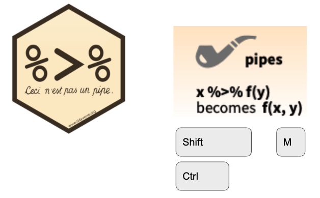

```{css, include = FALSE, eval = TRUE}
/* Extra CSS */
.hljs-github .hjls {
  background: black;
}
.small {
  font-size: 70%;
}

.tiny {
  font-size: 60%;
}

.large {
  font-size: 200%;
}

.small pre .remark-code {
  font-size: 75%;
}
.small .remark-code {
  font-size: 80%;
}
.tiny .remark-code {
  font-size: 60%;
}
.medium .remark-code {
  font-size: 90%;
}

```


# The Pipe `%>%`


---

```{r}
library(tidyverse)
library(dplyr)     #redundant
library(magrittr)  #doubly redundant
```

---

```{r, eval = FALSE}
data %>% 
  do_something(.) %>% 
  do_another_thing(.) %>% 
  do_last_thing(.)
```

--

`do_something(data)` is equivalent to:  

--

* `data %>% do_something(data = .)`  

--

* `data %>% do_something(.)`  

--

* `data %>% do_something()`  

---

## About the penguins


```{r}
penguins <- palmerpenguins::penguins 

penguins %>% 
  glimpse()
```
---

## More Complex Example

```{r, eval = FALSE}
penguins %>% 
  filter(species == "Adelie" & !is.na(sex)) %>%                   
  group_by(sex, island) %>%                                 
  summarize(mean = mean(body_mass_g, na.rm = TRUE)) 
```

--

```{r, echo = FALSE}
penguins %>% 
  filter(species == "Adelie" & !is.na(sex)) %>%                   
  group_by(sex, island) %>%                                 
  summarize(mean = mean(body_mass_g, na.rm = TRUE)) 
```

---

## IRL example

```{r, echo=FALSE}
#simulated Salesforce data
sf_opps <- tribble(
  ~account_name, ~fiscal_year, ~fiscal_quarter, ~total_price, ~is_won,
  "Acme", 2017, 'Q3', 0, TRUE,
  "Acme", 2019, 'Q1', 10000, TRUE,
  "Acme", 2019, 'Q2', 10000, FALSE,
  "Acme", 2019, "Q4", 15000, TRUE,
  "Acme", 2020, "Q1", 5000, TRUE,
  "Acme", 2020, "Q2", 5000, TRUE
  
)
```
```{r eval=FALSE, message=FALSE}
trailing_4q <- tibbletime::rollify(sum, window = 4)

trailing_12mo <- sf_opps %>% 
    group_by(account_name, fiscal_year, fiscal_quarter) %>% 
    summarise(revenue = sum(total_price * is_won)) %>% 
    ungroup() %>% 
    complete(account_name, fiscal_year, fiscal_quarter, fill = list(revenue = 0)) %>% 
    arrange(account_name, fiscal_year, fiscal_quarter) %>%  
    group_by(account_name) %>% 
    mutate(t12 = trailing_4q(revenue)) %>% 
    filter(fiscal_year >= 2019)
```
--
```{r results='asis', echo = FALSE, message=FALSE}
library(tibbletime)
trailing_4q <- rollify(sum, window = 4)

trailing_12mo <- sf_opps %>% 
    group_by(account_name, fiscal_year, fiscal_quarter) %>% 
    summarise(revenue = sum(total_price * is_won)) %>% 
    ungroup() %>% 
    complete(account_name, fiscal_year, fiscal_quarter, fill = list(revenue = 0)) %>% 
    group_by(account_name) %>% 
    mutate(t12 = trailing_4q(revenue)) %>% 
    filter(fiscal_year >= 2019)

knitr::kable(trailing_12mo)

```

